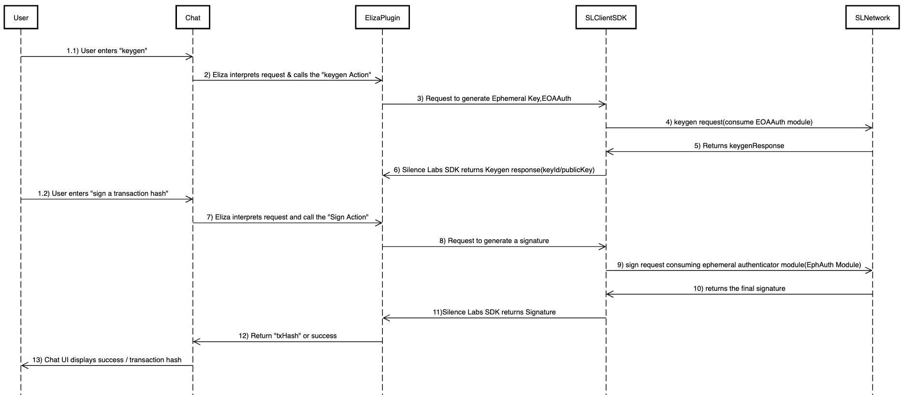

# @elizaos/plugin-sl

This Eliza OS plugin enables seamless interaction with Silence Labs' Wallet Provider SDK, allowing key generation, signing, and transaction management. The plugin uses MockWallet instead of MetaMask and integrates with the Eliza OS framework.


## Features

- Key Generation: Uses WalletProviderServiceClient for distributed key generation.
- MockWallet Support: Mimics an EOA for authentication without requiring MetaMask.
- Ephemeral Key Handling: Generates and manages ephemeral keys for secure signing.
- Integration with Eliza OS: Works as an Eliza OS action, enabling automated workflows.


## Installation

```bash
pnpm install @elizaos/plugin-sl
```

## Configuration

### Required Environment Variables

```env
# Required
MOCK_SIGNER_PRIVATEKEY = "your private key"
WALLET_PROVIDER_URL = "Wallet provider URL",

```
- note: contact SL team to get the wallet provider URL

### Architecture and Interaction Flow
The following sequence diagram illustrates the interaction between Eliza OS, Silence Labs SDK, Eliza OS Plugin, and Silence Labs Backend.




## Actions

### 1. Keygen

Generate a ephemeral keypair:

```typescript
// Example: Generate a new keypair
start Keygen
```

### 2. sign

Sign a unsigned transaction using the ephemeral keypair:
```typescript
// Example: Sign a transaction
sign 0x1234567890abcdef
```

## Development

1. Clone the repository
2. Install dependencies:

```bash
pnpm install
```

3. Build the plugin:

```bash
pnpm run build
```

4. Run the plugin:

```bash
pnpm start --character="characters/dobby.character.json"
```
